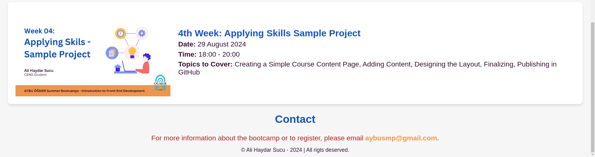

# Bootcamp - Schedule

A final project sample of the summer bootcamp of “Introduction to Froont-End Development” which coordinated by AYBU ÖĞMER (Learning and Teaching Center of Ankara Yıldırım Beyazıt University.)

## About The Bootcamp
"Introduction to Front-End Developmet: Learn the  Fundamentals of The Internet, Dive into Web Design"

The online summer bootcamp aimed to introduce the basics of front-end web development. You can click on [this link](https://www.linkedin.com/feed/update/urn:li:activity:7226548091791806464/) to read the university's official announcement.

As the instructor of this bootcamp, I covered basic Internet knowledge and introduced the fundamentals of HTML and CSS to the participants. 
In the last week of the bootcamp, we designed a simple website using basic HTML and CSS knowledge as an example for the final project of the bootcamp. 

## Link and View

https://alihaydarsucu.github.io/BootCamp.github.io/

